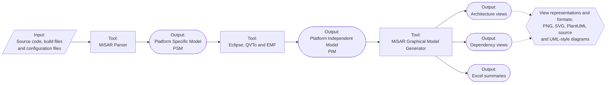

# MiSAR — Microservice Architecture Recovery

MiSAR is a research-driven approach for the semi-automatic recovery of architectural models from implemented microservice systems. It follows Model-Driven Architecture principles to derive progressively more abstract representations of a system, from implementation artefacts to architectural models and visual outputs.

## MiSAR workflow

The recovered **Platform Independent Model** represents the architecture of the analysed microservice system independently of its implementation platform.

## Repositories

| Repository                                                                                                                                   | Role                                                                                                                                                                      |
|----------------------------------------------------------------------------------------------------------------------------------------------|---------------------------------------------------------------------------------------------------------------------------------------------------------------------------|
| **[MiSAR Parser, Transformation Engine and AIO](https://github.com/MicroServiceArchitectureRecovery/MiSAR-Parser-and-Model-Transformation)** | The operational core of MiSAR. It contains the All-in-One launcher, the parser, the PSM metamodel, the transformation resources, and the maintained documentation source. |
| **[MiSAR Graphical Model Generator](https://github.com/MicroServiceArchitectureRecovery/misar-plantUML)**                                    | Converts a MiSAR PIM into visual and tabular outputs, including architecture views, dependency views, SVG diagrams, and Excel summaries.                                  |
| **[MiSAR overview](https://github.com/MicroServiceArchitectureRecovery/misar)**                                                              | Provides a concise project-level entry point and links the MiSAR repositories together.                                                                                   |

## Requirements Overview

To run the complete MiSAR workflow successfully, users should have access to the following tools:

| MiSAR component           | Requirement                              |
|---------------------------|------------------------------------------|
| MiSAR AIO and Parser      | Python 3.11 or later, including `pip`    |
| PSM-to-PIM transformation | OpenJDK 21, Eclipse, QVTo and EMF        |
| Graphical Model Generator | Java 21 or later, tested with OpenJDK 21 |

The detailed installation and configuration instructions are maintained in the [MiSAR documentation](https://microservicearchitecturerecovery.github.io/MiSAR-Parser-and-Model-Transformation/).

## Demonstration

A video demonstration of the MiSAR workflow is available on **[YouTube](https://www.youtube.com/watch?v=sdRDkLesyS0)**.

## Documentation

Use the documentation for all current guidance:

- **[MiSAR documentation](https://microservicearchitecturerecovery.github.io/MiSAR-Parser-and-Model-Transformation/)**
- **[Installation guide](https://microservicearchitecturerecovery.github.io/MiSAR-Parser-and-Model-Transformation/installation/)**
- **[Create a PSM](https://microservicearchitecturerecovery.github.io/MiSAR-Parser-and-Model-Transformation/create-psm/)**
- **[Create a PIM](https://microservicearchitecturerecovery.github.io/MiSAR-Parser-and-Model-Transformation/create-pim/)**
- **[Graphical Model Generator guide](https://microservicearchitecturerecovery.github.io/MiSAR-Parser-and-Model-Transformation/graphical-generator/)**

## Copyright

© 2020-2026 Dr Nour Ali, Brunel University London. All rights reserved. MiSAR is made openly available for research and evaluation purposes. The intellectual property and copyright of this tool and its associated research remain with Dr Nour Ali and Brunel University London.